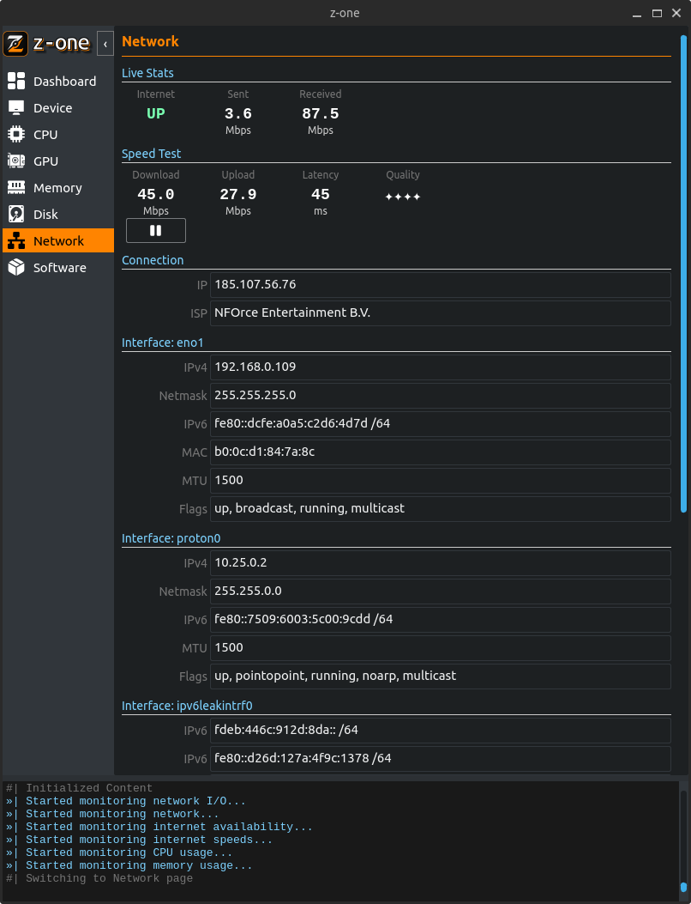

#z-one - System Information and Monitoring Tool

**z-one** is a Python application designed to gather system information and monitor various aspects of your computer's performance. The app is currently compatible with Ubuntu, and future plans include adding Windows support.

## Information Gathering Features

- Device Information
- Motherboard Specifications
- BIOS Information
- CPU Specifications
- Display Adapter(s) Information
- RAM Device(s) Information
- Physical Disk(s) Information
- Partition(s) Information
- Operating System Information
- Installed Apps

## Live Monitoring Features

- CPU Usage
- CPU Frequency
- RAM Usage
- Internet Availability
- Network Usage (Sent/Received)
- Speed Test (Download/Upload)
- Connection Latency
- Connection Quality
- External IP
- ISP Name
- Network Interface(s)

## Getting Started

### Prerequisites

- Python 3.10

### Installation

1. Clone the repository:
   ```
   git clone https://github.com/joe-dm/z-one-app
   ```

2. *(Optional)* Create a virtual environment:
   ```
   python3 -m venv z-one-venv
   ```

3. *(Optional)* Activate the virtual environment:
   ```
   source z-one-venv/bin/activate
   ```

4. Navigate to the project's root folder:
   ```
   cd z-one-app
   ```

5. Install dependencies:
   ```
   pip install -r requirements.txt
   ```

6. Run the application:
   ```
   python3 app/main.py
   ```

## Usage

- On startup, the application will prompt you for the admin password to access full system information. You can choose to ignore the prompt, but certain details may be unavailable without admin privileges.
- You have the option to pause the speed test to minimize the impact on network performance.
- Use the sidebar to navigate between different pages, each representing specific system information.
- Log output is visible via the console widget at the bottom of the window. If you want to access the log file, you can do so by navigating to the 'logs' folder that is created in the root directory.

## Future Plans

- Windows support
- Version checking
- Enhance the user interface
- Check if OS needs updates
- Add CPU information, such as the number of active threads/processes and the ability to monitor individual core usage
- Add GPU information and live monitoring of GPU usage
- Add memory information, such as swap memory
- Add disk live usage monitor
- Add network discovery capabilities using nmap
- Improve the Software page to include live monitoring of running apps
- Create a settings page
- Create separate log files for each aspect of the system
- Create an 'assistant' module to monitor various aspects of the system and give the user recommendations and notifications


## Screenshots
Dashboard Page<br>


Device Page<br>


CPU Page<br>


GPU Page<br>


Memory Page<br>


Disk Page<br>


Network Page<br>


Software Page<br>


## Contributing

Contributions to the project are welcome! If you have any suggestions, bug reports, or feature requests, please feel free to open an issue or submit a pull request.

## License

This project is licensed under the [MIT License](LICENSE).

## Attributions

The stylesheet used in the project is a modified version of the dark stylesheet from https://github.com/ColinDuquesnoy/QDarkStyleSheet

The icons used in the project were downloaded from:
- https://iconhub.io?ref=svgrepo.com
- https://www.svgrepo.com/svg/385176/pc-monitor-screen
- https://github.com/halfmage/pixelarticons?ref=svgrepo.com
- https://www.flaticon.com/authors/prosymbols
- https://github.com/framework7io/framework7-icons?ref=svgrepo.com
- https://www.lightningdesignsystem.com/?ref=svgrepo.com
- https://www.lightningdesignsystem.com/?ref=svgrepo.com
- https://icooon-mono.com/?ref=svgrepo.com
- https://www.figma.com/@leonid?ref=svgrepo.com
- https://gitlab.gnome.org/GNOME/adwaita-icon-theme?ref=svgrepo.com
- https://github.com/FortAwesome/Font-Awesome?ref=svgrepo.com
- https://github.com/neuicons/neu?ref=svgrepo.com
- https://www.svgrepo.com/svg/526077/pause
- https://www.svgrepo.com/svg/526106/play
